# EXO Private Search

A privacy-preserving search system based on [MIT's Tiptoe paper](https://people.csail.mit.edu/nickolai/papers/henzinger-tiptoe.pdf). This implementation allows you to search through data while maintaining query privacy - the server never learns what you're searching for. For more details, see our [blog](https://blog.exolabs.net/day-8/).

## Project Structure
- [`simplepir`](simplepir/README.md) – a Rust implementation of [SimplePIR](https://eprint.iacr.org/2022/949) (Henzinger et al.)
- [`tiptoe`](tiptoe/README.md) – implements [Tiptoe](https://eprint.iacr.org/2023/1438) and queries real-time stock/crypto prices from Yahoo Finance's API. 

## Features
- Privacy-preserving search using PIR
- Local embedding generation
- Clustering-based optimization for faster searches

## How It Works

1. Documents are converted into embeddings and clustered for efficient searching
2. The client downloads cluster centroids (~32 kB for a 1 GB database)
3. The client locally compares query vectors to centroids to find relevant clusters
4. Using SimplePIR, the client privately retrieves matching documents
5. All queries remain private - the server never sees what you're searching for

*Architecture overview of private search with homomorphic encryption. The query is encrypted before being sent to the server, which processes it without being able to see the contents. The encrypted results are sent back to the client for decryption.*

## Architecture

The system uses a combination of:
- Sentence transformers for embedding generation
- K-means clustering for search optimization
- SimplePIR for private information retrieval

## Privacy Guarantees

- Queries are never revealed to the server
- Document retrieval patterns remain private
- All sensitive computations happen client-side
- Server only sees encrypted PIR queries

## Performance

The clustering-based approach provides significant performance improvements:
- Reduces the number of PIR operations needed
- Allows for efficient searching in large document collections
- Maintains privacy while providing fast results

## Contributing

Contributions are welcome! Please feel free to submit a Pull Request.

## License

This project is open source and available under the MIT License. 